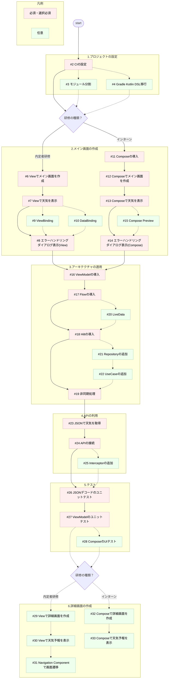

# 課題の進め方

```mermaid
flowchart TB
  classDef required stroke:#caa,fill:#fee,color:#000
  classDef optional stroke:#aca,fill:#efe,color:#000
  subgraph "凡例"
    issue-required["必須・選択必須"]:::required
    issue-optional["任意"]:::optional
  end
  start([start])-->issue2
  subgraph "1.プロジェクトの設定"
    issue2["#2 CIの設定"]:::required
    issue2-.->issue3["#3 モジュール分割"]:::optional
    issue2-.->issue4["#4 Gradle Kotlin DSL移行"]:::optional
  end
  issue2-->main_screen_if{"研修の種類？"}
  issue3 & issue4-.->main_screen_if
  main_screen_if--"内定者研修"-->issue6
  main_screen_if--"インターン"-->issue11
  subgraph "2.メイン画面の作成"
    issue6["#6 Viewでメイン画面を作成"]:::required
    issue6-->issue7["#7 Viewで天気を表示"]:::required
    issue7-->issue8["#8 エラーハンドリング\nダイアログ表示(View)"]:::required
    issue7-.->issue9["#9 ViewBinding"]:::optional
    issue7-.->issue10["#10 DataBinding"]:::optional
    issue9 & issue10-.->issue8
    issue11["#11 Composeの導入"]:::required
    issue11-->issue12["#12 Composeでメイン画面を作成"]:::required
    issue12-->issue13["#13 Composeで天気を表示"]:::required
    issue13-->issue14["#14 エラーハンドリング\nダイアログ表示(Compose)"]:::required
    issue13-.->issue15["#15 Compose Preview"]:::optional
    issue15-.->issue14
  end
  subgraph "3.アーキテクチャの適用"
    issue16["#16 ViewModelの導入"]:::required
    issue8-->issue16
    issue14-->issue16
    issue16-->issue17["#17 Flowの導入"]:::required
    issue17-->issue18["#18 Hiltの導入"]:::required
    issue18-->issue19["#19 非同期処理"]:::required
    issue17-.->issue20["#20 LiveData"]:::optional
    issue20-.->issue18
    issue18-.->issue21["#21 Repositoryの追加"]:::optional
    issue21-.->issue22["#22 UseCaseの追加"]:::optional
    issue22-.->issue19
  end
  subgraph "4.APIの利用"
    issue19-->issue23["#23 JSONで天気を取得"]:::required
    issue23-->issue24["#24 APIの接続"]:::required
    issue24-.->issue25["#25 Interceptorの追加"]:::optional
  end
  subgraph "5.テスト"
    issue24-->issue26["#26 JSONデコードのユニットテスト"]:::required
    issue25-.->issue26
    issue26-->issue27["#27 ViewModelのユニットテスト"]:::required
    issue27-.->issue28["#28 ComposeのUIテスト"]:::optional
  end
  issue27 & issue28-.->detail_screen_if{"研修の種類？"}
  detail_screen_if-."内定者研修".->issue29
  detail_screen_if-."インターン".->issue32
  subgraph "6.詳細画面の作成"
    issue29["#29 Viewで詳細画面を作成"]:::optional
    issue29-.->issue30["#30 Viewで天気予報を表示"]:::optional
    issue30-.->issue31["#31 Navigation Componentで画面遷移"]:::optional
    issue32["#32 Composeで詳細画面を作成"]:::optional
    issue32-.->issue33["#33 Composeで天気予報を表示"]:::optional
  end
click issue2 "https://github.com/yumemi-inc/android-training-template/issues/2"
click issue3 "https://github.com/yumemi-inc/android-training-template/issues/3"
click issue4 "https://github.com/yumemi-inc/android-training-template/issues/4"
click issue5 "https://github.com/yumemi-inc/android-training-template/issues/5"
click issue6 "https://github.com/yumemi-inc/android-training-template/issues/6"
click issue7 "https://github.com/yumemi-inc/android-training-template/issues/7"
click issue8 "https://github.com/yumemi-inc/android-training-template/issues/8"
click issue9 "https://github.com/yumemi-inc/android-training-template/issues/9"
click issue10 "https://github.com/yumemi-inc/android-training-template/issues/10"
click issue11 "https://github.com/yumemi-inc/android-training-template/issues/11"
click issue12 "https://github.com/yumemi-inc/android-training-template/issues/12"
click issue13 "https://github.com/yumemi-inc/android-training-template/issues/13"
click issue14 "https://github.com/yumemi-inc/android-training-template/issues/14"
click issue15 "https://github.com/yumemi-inc/android-training-template/issues/15"
click issue16 "https://github.com/yumemi-inc/android-training-template/issues/16"
click issue17 "https://github.com/yumemi-inc/android-training-template/issues/17"
click issue18 "https://github.com/yumemi-inc/android-training-template/issues/18"
click issue19 "https://github.com/yumemi-inc/android-training-template/issues/19"
click issue20 "https://github.com/yumemi-inc/android-training-template/issues/20"
click issue21 "https://github.com/yumemi-inc/android-training-template/issues/21"
click issue22 "https://github.com/yumemi-inc/android-training-template/issues/22"
click issue23 "https://github.com/yumemi-inc/android-training-template/issues/23"
click issue24 "https://github.com/yumemi-inc/android-training-template/issues/24"
click issue25 "https://github.com/yumemi-inc/android-training-template/issues/25"
click issue26 "https://github.com/yumemi-inc/android-training-template/issues/26"
click issue27 "https://github.com/yumemi-inc/android-training-template/issues/27"
click issue28 "https://github.com/yumemi-inc/android-training-template/issues/28"
click issue29 "https://github.com/yumemi-inc/android-training-template/issues/29"
click issue30 "https://github.com/yumemi-inc/android-training-template/issues/30"
click issue31 "https://github.com/yumemi-inc/android-training-template/issues/31"
click issue32 "https://github.com/yumemi-inc/android-training-template/issues/32"
click issue33 "https://github.com/yumemi-inc/android-training-template/issues/33"

```
